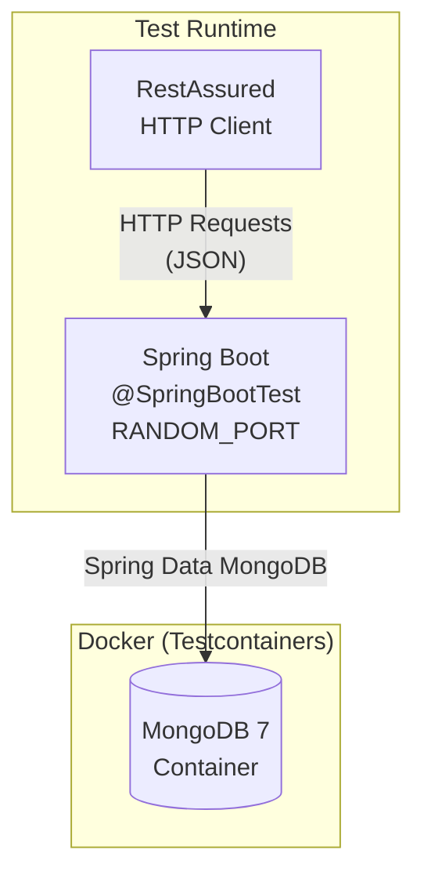

# Budgetly API — E2E Testing Plan (RestAssured + Docker MongoDB)

> **Goal:** Implement comprehensive E2E tests for all Budgetly API endpoints using **RestAssured** framework with **Docker-based MongoDB** (via Testcontainers) — replacing the Flapdoodle embedded MongoDB approach entirely.

---

## 1. Architecture Overview



### Key Design Decisions

| Decision | Choice | Rationale |
|----------|--------|-----------|
| **MongoDB** | Testcontainers `mongo:7` | Real MongoDB instance, no Flapdoodle dependency, mirrors production |
| **Test Style** | `@SpringBootTest(webEnvironment = RANDOM_PORT)` | Full application context, real HTTP requests via RestAssured |
| **Auth in Tests** | Test-scoped `JwtTokenProvider` generates real JWTs | No mocking of security — tests exercise the full auth filter chain |
| **Google OAuth** | `@MockBean GoogleTokenVerifier` | External dependency — mock to return controlled user infos |
| **LLM/Gemini** | `@MockBean LlmProvider` (when needed) | External API — mock for deterministic SMS processing tests |
| **Database Cleanup** | `@BeforeEach` drops all collections | Each test starts with a clean database |
| **Test Execution** | Maven Surefire (`mvn test`) | E2E tests run as part of the standard test phase |

---

## 2. Infrastructure Changes

### 2.1 Remove Flapdoodle, Update `pom.xml`

#### [MODIFY] [pom.xml](file:///d:/git/budgetly/budgetly_api/pom.xml)

- **Remove** the Flapdoodle dependency (lines 124–130):
  ```diff
  -        <!-- Embedded MongoDB for E2E tests (no Docker required) -->
  -        <dependency>
  -            <groupId>de.flapdoodle.embed</groupId>
  -            <artifactId>de.flapdoodle.embed.mongo.spring3x</artifactId>
  -            <version>${flapdoodle.version}</version>
  -            <scope>test</scope>
  -        </dependency>
  ```
- **Remove** the `flapdoodle.version` property (line 31)
- **Keep** existing Testcontainers `mongodb` and `junit-jupiter` dependencies (already present)
- **Keep** existing RestAssured `rest-assured` dependency (already present)
- **Remove** RestAssured `spring-mock-mvc` dependency (not needed for full-server E2E tests)

### 2.2 Update Test Application Config

#### [MODIFY] [application-test.yml](file:///d:/git/budgetly/budgetly_api/src/test/resources/application-test.yml)

- **Remove** the static `mongodb.uri` (Testcontainers will inject it dynamically)
- **Update comment** to reflect Docker-based approach

```yaml
spring:
  data:
    mongodb:
      # URI injected dynamically by Testcontainers via @DynamicPropertySource

server:
  port: 0  # Random port for tests

jwt:
  secret: test-secret-key-for-unit-tests-minimum-256-bits-long-enough
  expiration: 3600000
  refresh-expiration: 7200000

google:
  client-id: test-google-client-id

gemini:
  api-key: test-api-key
  api-url: http://localhost:8089/gemini-mock

pattern:
  report-threshold: 3

logging:
  level:
    com.budgetly: WARN
    org.springframework.security: WARN
```

---

## 3. Test Infrastructure Classes

### 3.1 Base Test Class

#### [NEW] [BaseE2ETest.java](file:///d:/git/budgetly/budgetly_api/src/test/java/com/budgetly/api/e2e/BaseE2ETest.java)

Shared superclass for all E2E test suites providing:

- **Testcontainers MongoDB**: `@Container` with `MongoDBContainer("mongo:7")` + `@DynamicPropertySource` to inject the connection URI
- **RestAssured Setup**: `@BeforeEach` configures `RestAssured.port` from `@LocalServerPort`
- **JWT Helper**: Injects `JwtTokenProvider` to create valid test tokens (`getAuthToken(userId)`)
- **Test Data Seeding**: Helper methods to seed a user, family, category, etc. directly via repositories
- **Database Cleanup**: `@BeforeEach` drops all collections via `MongoTemplate`
- **GoogleTokenVerifier Mock**: `@MockBean` to simulate Google OAuth token verification

```java
@SpringBootTest(webEnvironment = SpringBootTest.WebEnvironment.RANDOM_PORT)
@ActiveProfiles("test")
@Testcontainers
public abstract class BaseE2ETest {

    @Container
    static MongoDBContainer mongoContainer = new MongoDBContainer("mongo:7");

    @DynamicPropertySource
    static void configureProperties(DynamicPropertyRegistry registry) {
        registry.add("spring.data.mongodb.uri", mongoContainer::getReplicaSetUrl);
    }

    @LocalServerPort
    protected int port;

    @Autowired
    protected JwtTokenProvider jwtTokenProvider;

    @Autowired
    protected MongoTemplate mongoTemplate;

    @MockBean
    protected GoogleTokenVerifier googleTokenVerifier;

    // Repositories for seeding
    @Autowired protected UserRepository userRepository;
    @Autowired protected FamilyGroupRepository familyGroupRepository;
    @Autowired protected FamilyMemberRepository familyMemberRepository;
    @Autowired protected CategoryRepository categoryRepository;
    @Autowired protected TransactionRepository transactionRepository;
    @Autowired protected MessageRepository messageRepository;
    @Autowired protected PatternRegistryRepository patternRegistryRepository;

    @BeforeEach
    void setUp() {
        RestAssured.port = port;
        RestAssured.basePath = "/api/v1";
        // Drop all collections for clean state
        mongoTemplate.getCollectionNames()
            .forEach(mongoTemplate::dropCollection);
    }

    protected String getAuthToken(String userId) {
        return jwtTokenProvider.generateAccessToken(userId);
    }

    // Helper: seed a user document, returns userId
    protected String seedUser(String googleId, String displayName, String email) { ... }

    // Helper: seed a family group, returns familyGroupId
    protected String seedFamily(String userId, String name) { ... }

    // Helper: seed a category, returns categoryId
    protected String seedCategory(String familyGroupId, String name, String icon) { ... }
}
```

---

## 4. E2E Test Suites

### 4.1 Auth E2E Tests

#### [NEW] [AuthE2ETest.java](file:///d:/git/budgetly/budgetly_api/src/test/java/com/budgetly/api/e2e/AuthE2ETest.java)

| # | Test Case | HTTP | Expected |
|---|-----------|------|----------|
| 1 | **Google Sign-In** — valid ID token → returns JWT | `POST /auth/google` | `200`, body has `accessToken`, `refreshToken`, `user` |
| 2 | **Google Sign-In** — invalid token → 401 | `POST /auth/google` | `401` |
| 3 | **Refresh Token** — valid refresh → new access token | `POST /auth/refresh` | `200`, new `accessToken` |
| 4 | **Refresh Token** — expired/invalid → 401 | `POST /auth/refresh` | `401` |
| 5 | **Get Current User** — valid JWT → returns user profile | `GET /auth/me` | `200`, user fields match |
| 6 | **Get Current User** — no auth header → 401 | `GET /auth/me` | `401` / `403` |

**Notes:** GoogleTokenVerifier is mocked via `@MockBean`. When mocked to return valid payload, `AuthService.googleSignIn()` creates/finds user and issues JWT. Token refresh uses the real `JwtTokenProvider`.

---

### 4.2 Family Group E2E Tests

#### [NEW] [FamilyGroupE2ETest.java](file:///d:/git/budgetly/budgetly_api/src/test/java/com/budgetly/api/e2e/FamilyGroupE2ETest.java)

| # | Test Case | HTTP | Expected |
|---|-----------|------|----------|
| 1 | **Create Family** | `POST /families` | `201`, returns `FamilyGroup` with id |
| 2 | **Get Family** | `GET /families/{id}` | `200`, correct name, budget |
| 3 | **Update Family** (name, currency, alerts) | `PUT /families/{id}` | `200`, updated fields |
| 4 | **Delete Family** (admin only) | `DELETE /families/{id}` | `204` |
| 5 | **Invite to Family** | `POST /families/{id}/invite` | `200`, returns invite code/link |
| 6 | **Join Family** via invite code | `POST /families/{id}/join` | `200`, new member added |
| 7 | **List Members** | `GET /families/{id}/members` | `200`, list includes creator as ADMIN |
| 8 | **Update Member Role** | `PUT /families/{id}/members/{mid}` | `200`, role changed |
| 9 | **Remove Member** | `DELETE /families/{id}/members/{mid}` | `204` |
| 10 | **Non-member access denied** | `GET /families/{id}` (different user) | `403` |

---

### 4.3 Category E2E Tests

#### [NEW] [CategoryE2ETest.java](file:///d:/git/budgetly/budgetly_api/src/test/java/com/budgetly/api/e2e/CategoryE2ETest.java)

| # | Test Case | HTTP | Expected |
|---|-----------|------|----------|
| 1 | **Create Category** | `POST /families/{fid}/categories` | `201`, returns `Category` |
| 2 | **List Categories** | `GET /families/{fid}/categories` | `200`, includes seeded + created |
| 3 | **Update Category** (name, icon, budget) | `PUT /families/{fid}/categories/{id}` | `200` |
| 4 | **Delete Category** | `DELETE /families/{fid}/categories/{id}` | `204` |
| 5 | **Non-member cannot create** | `POST /families/{fid}/categories` (wrong user) | `403` |

---

### 4.4 Transaction E2E Tests

#### [NEW] [TransactionE2ETest.java](file:///d:/git/budgetly/budgetly_api/src/test/java/com/budgetly/api/e2e/TransactionE2ETest.java)

| # | Test Case | HTTP | Expected |
|---|-----------|------|----------|
| 1 | **Create Transaction** (expense) | `POST /families/{fid}/transactions` | `201`, correct amount, category |
| 2 | **Get Transaction** by id | `GET /families/{fid}/transactions/{id}` | `200`, all fields match |
| 3 | **Update Transaction** | `PUT /families/{fid}/transactions/{id}` | `200`, updated merchant |
| 4 | **Delete Transaction** | `DELETE /families/{fid}/transactions/{id}` | `204` |
| 5 | **List Transactions** — pagination | `GET /families/{fid}/transactions?page=0&size=5` | `200`, paginated response |
| 6 | **List Transactions** — filter by type | `GET /families/{fid}/transactions?type=EXPENSE` | `200`, only expenses |
| 7 | **List Transactions** — filter by date range | `GET ...?startDate=...&endDate=...` | `200`, within range |
| 8 | **Create Transaction with split** (PERCENT) | `POST /families/{fid}/transactions` | `201`, splitConfig saved |

---

### 4.5 Message (SMS Processing) E2E Tests

#### [NEW] [MessageE2ETest.java](file:///d:/git/budgetly/budgetly_api/src/test/java/com/budgetly/api/e2e/MessageE2ETest.java)

| # | Test Case | HTTP | Expected |
|---|-----------|------|----------|
| 1 | **Process Message** — financial SMS → transaction created | `POST /messages/process` | `200`, `isFinancial=true` |
| 2 | **Process Message** — non-financial SMS | `POST /messages/process` | `200`, `isFinancial=false` |
| 3 | **Get Pending Messages** | `GET /messages/pending` | `200`, list of PENDING messages |
| 4 | **Get Ignored Messages** | `GET /messages/ignored` | `200`, list of IGNORED messages |
| 5 | **Confirm Message** → transaction created | `POST /messages/{id}/confirm` | `200`, returns `Transaction` |
| 6 | **Reject Message** | `POST /messages/{id}/reject` | `200`, status = REJECTED |
| 7 | **Restore Message** | `POST /messages/{id}/restore` | `200`, status = PENDING |

**Notes:** `LlmProvider` (Gemini) is mocked via `@MockBean` to return deterministic `LlmAnalysisResult`.

---

### 4.6 Dashboard & Budget E2E Tests

#### [NEW] [DashboardE2ETest.java](file:///d:/git/budgetly/budgetly_api/src/test/java/com/budgetly/api/e2e/DashboardE2ETest.java)

| # | Test Case | HTTP | Expected |
|---|-----------|------|----------|
| 1 | **Get Dashboard** — empty (no transactions) | `GET /families/{fid}/dashboard` | `200`, zeroed stats |
| 2 | **Get Dashboard** — after adding transactions | `GET /families/{fid}/dashboard` | `200`, correct totals |
| 3 | **Get Budget Summary** — per-category breakdown | `GET /families/{fid}/budget/summary` | `200`, category buckets |
| 4 | **Update Budget** — set monthly limit | `PUT /families/{fid}/budget` | `200`, updated limit |
| 5 | **Over-budget detection** — expense exceeds budget | `GET /families/{fid}/budget/summary` | `200`, over-budget flag |

---

### 4.7 Pattern Registry E2E Tests

#### [NEW] [PatternRegistryE2ETest.java](file:///d:/git/budgetly/budgetly_api/src/test/java/com/budgetly/api/e2e/PatternRegistryE2ETest.java)

| # | Test Case | HTTP | Expected |
|---|-----------|------|----------|
| 1 | **Get All Patterns** | `GET /patterns` | `200`, list of patterns |
| 2 | **Get Patterns (delta sync)** | `GET /patterns?since=...` | `200`, only recent patterns |
| 3 | **Get Pattern Senders** | `GET /patterns/senders` | `200`, sender list with counts |
| 4 | **Report Pattern** — below threshold | `POST /patterns/{id}/report` | `200`, `removed=false` |
| 5 | **Report Pattern** — reaches threshold → auto-removed | `POST /patterns/{id}/report` (3 users) | `200`, `removed=true` |
| 6 | **Get Pattern Stats** | `GET /patterns/stats` | `200`, totalPatterns, totalSenders |

---

### 4.8 Security & Cross-Cutting E2E Tests

#### [NEW] [SecurityE2ETest.java](file:///d:/git/budgetly/budgetly_api/src/test/java/com/budgetly/api/e2e/SecurityE2ETest.java)

| # | Test Case | HTTP | Expected |
|---|-----------|------|----------|
| 1 | **No token** → all protected endpoints reject | Various | `401` / `403` |
| 2 | **Expired token** → reject | Various | `401` |
| 3 | **Malformed token** → reject | Various | `401` |
| 4 | **Public endpoints accessible** (health, swagger) | `GET /actuator/health` | `200` |
| 5 | **Cross-family isolation** — user A cannot access user B's family | Various | `403` |

---

## 5. Test File Structure

```
budgetly_api/src/test/
├── java/com/budgetly/api/
│   └── e2e/
│       ├── BaseE2ETest.java              ← Shared base (Testcontainers, RestAssured, helpers)
│       ├── AuthE2ETest.java              ← Auth flow tests
│       ├── FamilyGroupE2ETest.java       ← Family CRUD + members
│       ├── CategoryE2ETest.java          ← Category CRUD
│       ├── TransactionE2ETest.java       ← Transaction CRUD + filters
│       ├── MessageE2ETest.java           ← SMS processing pipeline
│       ├── DashboardE2ETest.java         ← Dashboard + budget
│       ├── PatternRegistryE2ETest.java   ← Pattern sync + reports
│       └── SecurityE2ETest.java          ← Auth enforcement + isolation
└── resources/
    └── application-test.yml              ← Updated (no Flapdoodle URI)
```

---

## 6. How to Run

### Prerequisites
- **Docker Desktop** must be running (Testcontainers needs Docker)
- Java 21+, Maven

### Commands

```bash
# Run all E2E tests
cd budgetly_api
mvn test

# Run a specific test suite
mvn test -Dtest=AuthE2ETest

# Run all E2E tests with verbose output
mvn test -Dtest="com.budgetly.api.e2e.*"
```

### CI Integration
The same `mvn test` command works in CI — Testcontainers auto-detects Docker availability. If Docker is unavailable, tests are skipped gracefully.

---

## 7. Implementation Order

| Phase | Files | Dependencies |
|-------|-------|-------------|
| **1. Infrastructure** | `pom.xml`, `application-test.yml`, `BaseE2ETest.java` | None |
| **2. Auth Tests** | `AuthE2ETest.java` | Phase 1 |
| **3. Family + Category** | `FamilyGroupE2ETest.java`, `CategoryE2ETest.java` | Phase 2 (needs auth helpers) |
| **4. Transaction** | `TransactionE2ETest.java` | Phase 3 (needs family + category) |
| **5. Message + Pattern** | `MessageE2ETest.java`, `PatternRegistryE2ETest.java` | Phase 2 (needs auth) |
| **6. Dashboard + Budget** | `DashboardE2ETest.java` | Phase 4 (needs transactions) |
| **7. Security** | `SecurityE2ETest.java` | Phase 1 |

---

## 8. Verification Plan

### Automated
```bash
cd budgetly_api
mvn test
# Expected: All E2E test suites pass (8 test classes, ~50+ test methods)
```

### Manual Verification
1. Confirm Docker container starts/stops automatically per test run (check `docker ps` during test execution)
2. Confirm no Flapdoodle references remain: `grep -r "flapdoodle" budgetly_api/`
3. Confirm clean database between tests (no cross-test data leakage)
